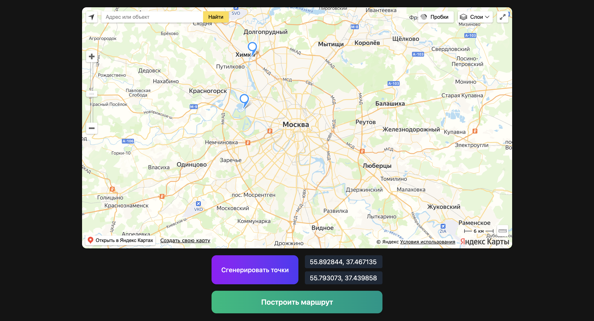

## Создание мини-проекта на картографической основе:
- генерация двух случайных координат в пределах города++
- отображение маркерами на интерактивной карте++
- возможность уточнения координат через пользовательский ввод++
- по клику на сабмит-контрол – построение линии между этими точками++
- сохранение состояния при перезагрузке странички++
---
Установка зависимостей
```
npm i
```

Запуск проекта 
```
npm run dev
```

Проект был реализован с помощью React yandex maps https://pbe-react-yandex-maps.vercel.app/
(leaflet + тайлы OSM из-за санцкий не работал, изображение карты не прогружалось).

## Технологии 
#### ReactJS, Typescript, Zustand, React-Hook-Form, TailwindCSS
---
1. Для генерации двух точек, был создан хук useGenerateCoordinate, который в пределах координат MOSCOW_BOUNDS создавал точки. 

2. Для отображения использовались компоненты React Yandex Maps
```
{points.map((p, i) => (
  <Placemark key={i} geometry={p} />
))}
```

3. С помощью React-Hook-Form пользователь корректирует координаты 
4. После генерации и ввода значений строится линия между точками
```
{isShow && points.length === 2 && (
  <GeoObject
    geometry={{
      type: 'LineString',
      coordinates: [points[0], points[1]],
    }}
    options={{
      geodesic: true,
      strokeWidth: 5,
      strokeColor: '#F008',
    }}
  />
)}
```
5. Состояние хранится в сторе Zustand, и кэшируется в localStorage

## Результат
